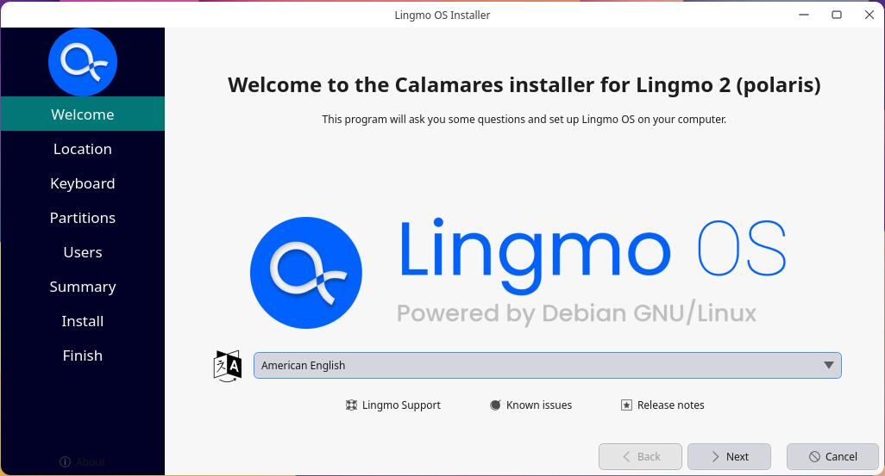

# User Install Guide for LingmoOS

## WARNING: Lingmo GNU/Linux comes with ABSOLUTELY NO WARRANTY, to the extent permitted by applicable law.

Fast, free and full of new features. The latest release of LingmoOS delivers new tools and enhancements for developers, creators, gamers and administrators. 

Let's discover **LingmoOS in less than 5 minutes**.

Please be aware that LingmoOS is in **BETA** - what this means is that LingmoOS is under heavy development and therefore **NOT** ready for every day use.

## 1. Overview

### What you’ll learn

In this tutorial, we will guide you through the steps required to install LingmoOS on your laptop or PC.

### What you'll need

- A laptop or PC with at least 25GB of storage space.

- A flash drive (12GB or above recommended).

## 2. Download a LingmoOS Image

You can download a LingmoOS image [here](https://lingmo.org/download). Make sure to save it to a memorable location on your PC! For this tutorial, we will use the LingmoOS 2.0 beta version which uses the new Lingmo installer that will be included in all future LingmoOS releases.

## 3. Create a Bootable USB stick

To install LingmoOS, you need to write your downloaded ISO to a USB stick to create the installation media. This is not the same as copying the ISO, and requires some bespoke software.

For this tutorial, we’ll use [balenaEtcher](https://etcher.balena.io/), as it runs on Linux, Windows and macOS. Choose the version that corresponds to your current operating system, download and install the tool.

Select your downloaded ISO, choose your USB flash drive, and then click `Flash!` to install your image.

## 4. Boot from USB flash drive

Insert the USB flash drive into the laptop or PC you want to use to install Ubuntu and boot or restart the device. It should recognize the installation media automatically. If not, try holding `F12` (according to your motherboard manufacturer) during startup and selecting the USB device from the system-specific boot menu.

> F12 is the most common key for bringing up your system’s boot menu, but Escape, F2 and F10 are common alternatives. If you’re unsure, look for a brief message when your system starts – this will often inform you of which key to press to bring up the boot menu.

On some older images, you will be required to enter a password to enter the live session. If you enconter this, enter the password `live` and press `Enter`.

Once logged into the live system, you can start the installer by clicking `Install Lingmo`.

Once the installer has initialised you will be invited to choose your language

> You can preview LingmoOS without making any changes to your PC. You can return to the installer menu at any time by clicking the Install Lingmo shortcut on the desktop.

To proceed, click `Next`.

## 5. Choose your Location

Select your location and timezone from the map screen and click `Next`. This information will be detected automatically if you are connected to the internet.

## 6. Choose your Keyboard Layout

You will be asked to select your keyboard layout. Once you’ve chosen one, click `Next`.

## 7. Choose your Partitioning

This screen allows you to configure your installation. If you would like LingmoOS to be the only operating system on your hard drive, select `Erase disk` and install LingmoOS.

If your device currently has another operating system installed, you will receive additional options to install LingmoOS alongside that OS rather than replacing it.

### Manual

When using Manual to set up your system as you would like it, keep these thoughts in mind:

The root ( / ) directory needs at least 25 GBs of space.

The home ( /home ) directory needs as much space as you will need for your files, music, pictures and documents. So it is best to use the remaining space for the home partition, unless you have going to dual boot.

Swap space of at least half of the available RAM is recommended. For instance, with 8 GBs, make the swap with at least 4 GBs.

> If you have a Windows 8 sticker on your machine you might need to make a separate EFI partition with a FAT32 filesystem.

For more detailed information regarding the Disk Setup of a Linux system you can check the [DiskSpace](disk_space.md) page.

## 8. Create Your Login Details

On this screen, you will be prompted to enter your name and the name of your computer as it will appear on the network. Finally, you will create a username and a strong password.

You can choose to log in automatically or require a password. If you are using your device whilst travelling, it’s **not** recommended to keep “Log in automatically” enabled.

## 9. Confirm the Installation

You will now be asked to review the settings you have chosen. If you are happy with them, click `Install`.

And then sit back and enjoy the slideshow as LingmoOS installs in the background! 🙂:

After reboot, you can enter your new system!

## 10. You’ve installed LingmoOS!

Thank you for completing this tutorial. We hope you enjoy your new desktop.
