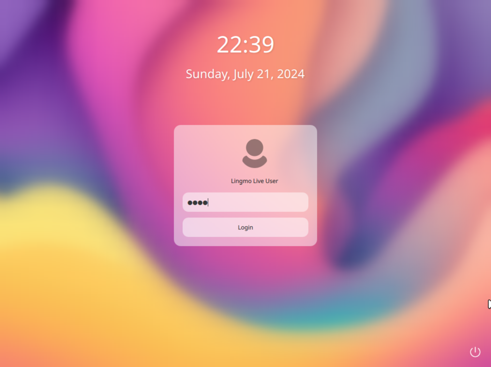
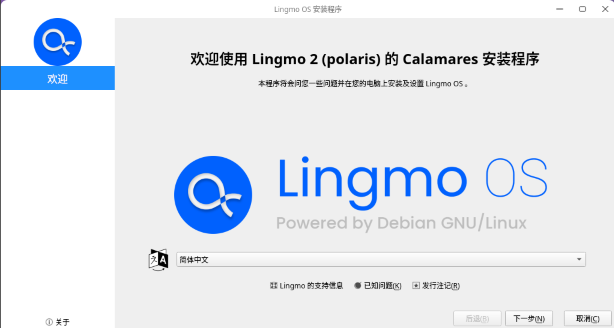
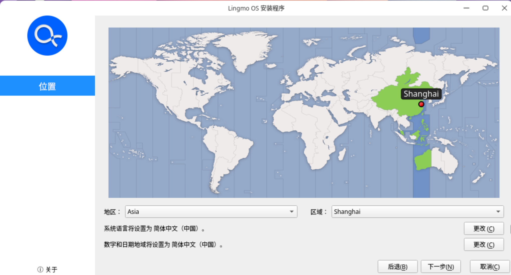
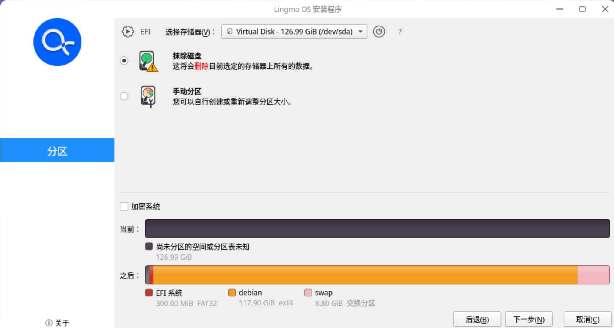
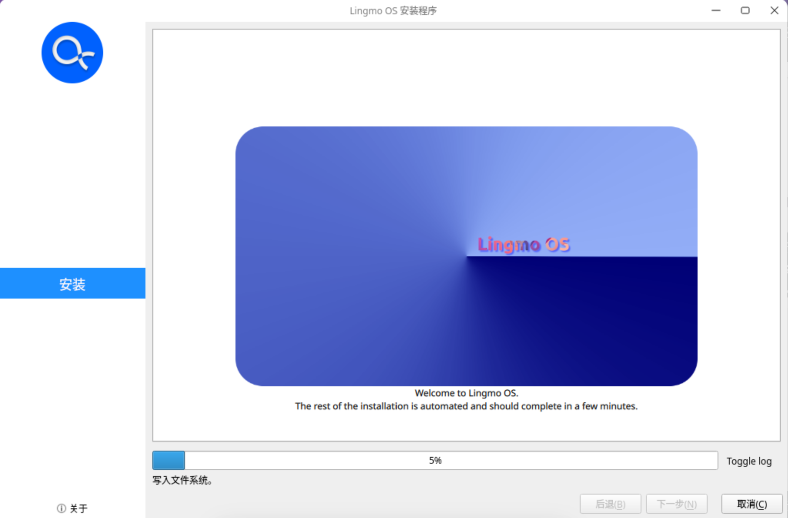

# Lingmo OS 安装教程
*警告：在适用法律允许的范围内，Lingmo GNU/Linux 不提供任何担保。*

本文将指导您如何安装 `Lingmo OS`。

### 准备工作
1. 下载并安装 `Lingmo OS` 的镜像文件。您可以在 [Lingmo OS 下载页面](https://www.lingmo.org/zh-cn/downloads) 下载最新版本的 `ISO` 安装镜像或在 [Github Actions](https://github.com/LingmoOS-Testing/live-build-config/actions) 页面下载最新测试版的 `ISO` 安装镜像。

    注意：测试版具有一定的不稳定性，如果您是小白，建议您下载正式版。

2. 准备一个 U 盘或移动硬盘，要求容量至少为 16 GB，并将其格式化为 FAT32 或 NTFS 文件系统。

3. [下载](https://rufus.ie/)并安装 `Rufus` 写盘软件，用于将 U 盘制作成用于安装系统的启动盘。

### 安装 Lingmo OS
1. 将待安装设备保持关机状态，插入 U 盘或移动硬盘，按下开机键，同时根据自己的机型连续多次按下进入启动顺序设置界面的按键（一般为 `F12`），并通过上下键将您的 U 盘或移动硬盘设为第一启动设备。
2. 等待 U 盘或移动硬盘启动，系统会自动检测到并加载 `Lingmo OS` 的安装镜像。
此时直接按下 `Enter` 键，即可进入 `Lingmo OS` 的安装程序。

**`Lingmo Live User` 的默认密码为 `live`**，输入后单击 `Login` 按钮即可进入 `Live` 系统。

此时双击桌面上的 `Install Lingmo OS` 即可进入安装程序。

1. 安装程序默认为英文，单击列表即可切换为简体中文。

1. 设置位置。在地图上单击靠近上海的位置即可自动定位至上海。

1. 设置键盘。你可以根据自己的喜好设置自己想要的键盘布局。当然如果您不知道这是什么，亦可保持默认设置，不会影响后续使用。

1. 磁盘分区。这一步首先需要您单击 `选择存储器` 右侧的列表，在弹出的列表中选择需要安装 `Lingmo OS` 的磁盘。接下来，建议您直接选择 `抹除磁盘` 选项，当然如果您对磁盘分区有一定经验，亦可参考[本文](../en/disk_space.md)对磁盘进行分区。

1. 设置用户。这一步中您可以设置您的用户名、计算机名称以及您的登录密码。**注意：系统安装完毕后，您在这一步设置的用户即您的登录用户，而非 `root` 用户，请牢记您的密码。**

1. 安装摘要。在这一步中，系统会显示您刚才的设置，确认无误后即可单击 `安装` 按钮开始安装。

1. 开始安装。安装过程中，系统会显示安装进度。等待安装完毕后，即可重启进入 `Lingmo OS` 的登录界面。

1.  安装完成。重启计算机，并把出您的安装介质。再次开机后，即可开始体验激动人心的 `Lingmo OS`！

